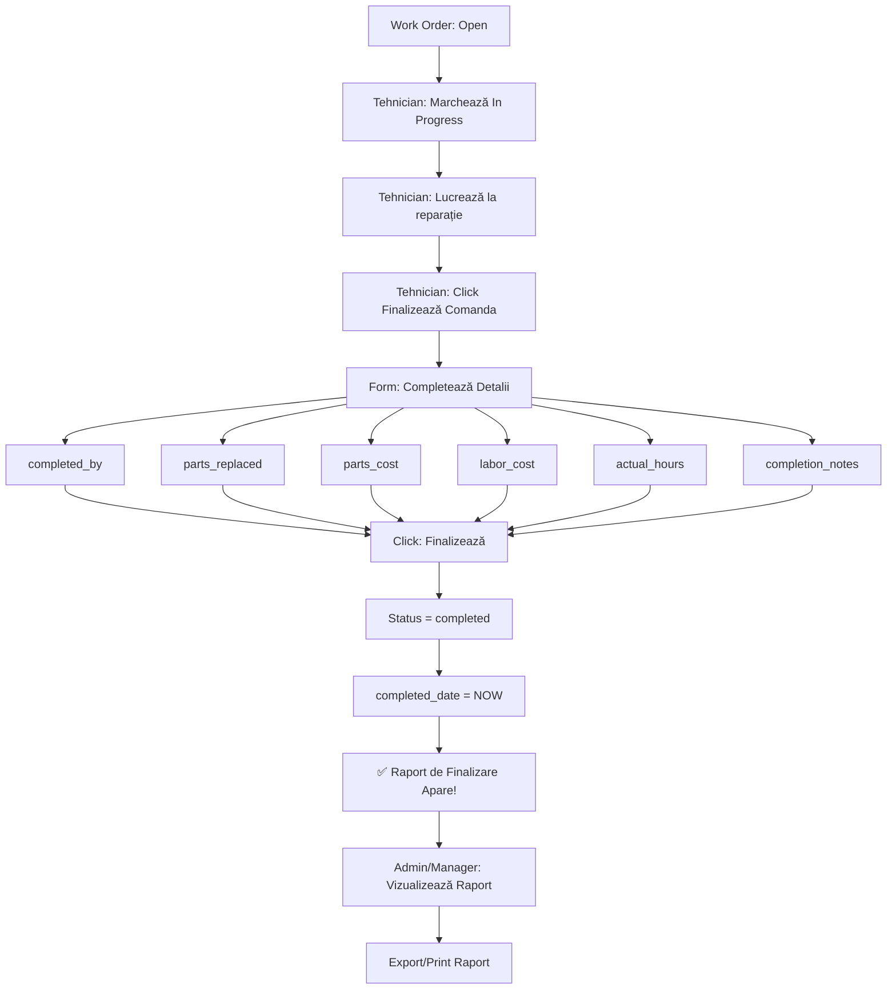

# Raport de Finalizare Work Orders - Ghid de Implementare

## 📋 Prezentare Generală

Această funcționalitate adaugă un **raport detaliat de finalizare** pentru toate work orders completate, permițând urmărirea:
- ✅ Piese înlocuite
- ✅ Costuri (piese + manoperă)  
- ✅ Ore lucrate vs. ore estimate
- ✅ Note detaliate ale tehnicianului
- ✅ Cine a efectuat lucrarea și când
- ✅ Export/Print raport

---

## 🗄️ Pasul 1: Actualizare Bază de Date

### Rulează Migrația SQL

1. Deschide **Supabase Dashboard**
2. Mergi la **SQL Editor**
3. Rulează conținutul din fișierul `add_work_order_completion_fields.sql`:

```sql
-- Migration: Add completion report fields to work_orders
ALTER TABLE work_orders 
ADD COLUMN IF NOT EXISTS completed_by TEXT,
ADD COLUMN IF NOT EXISTS parts_replaced TEXT,
ADD COLUMN IF NOT EXISTS parts_cost DECIMAL(10, 2),
ADD COLUMN IF NOT EXISTS labor_cost DECIMAL(10, 2),
ADD COLUMN IF NOT EXISTS completion_notes TEXT;

-- Add comments for documentation
COMMENT ON COLUMN work_orders.completed_by IS 'Name of technician who completed the work order';
COMMENT ON COLUMN work_orders.parts_replaced IS 'List of parts that were replaced during repair';
COMMENT ON COLUMN work_orders.parts_cost IS 'Total cost of parts used in repair';
COMMENT ON COLUMN work_orders.labor_cost IS 'Labor cost for the work performed';
COMMENT ON COLUMN work_orders.completion_notes IS 'Detailed notes from technician about the work performed, findings, and recommendations';

-- Create index for faster queries
CREATE INDEX IF NOT EXISTS idx_work_orders_status_completed ON work_orders(status) WHERE status = 'completed';
CREATE INDEX IF NOT EXISTS idx_work_orders_completed_date ON work_orders(completed_date) WHERE completed_date IS NOT NULL;
```

### Verificare Migrație

Rulează în SQL Editor pentru a verifica:
```sql
SELECT column_name, data_type, is_nullable
FROM information_schema.columns
WHERE table_name = 'work_orders'
AND column_name IN ('completed_by', 'parts_replaced', 'parts_cost', 'labor_cost', 'completion_notes');
```

Ar trebui să vezi toate cele 5 coloane noi.

---

## 💻 Pasul 2: Actualizare Cod Frontend

### Modifică WorkOrderDetail.jsx

**Locație:** `src/pages/WorkOrderDetail.jsx` (sau `/mnt/project/WorkOrderDetail.jsx`)

#### 2.1 Găsește această secțiune (aproximativ linia 389-420):

```jsx
{/* Equipment Info */}
{workOrder.equipment && (
  <div className="card">
    <h2 className="text-lg sm:text-xl font-semibold text-gray-900 mb-4">Equipment</h2>
    ...
  </div>
)}
```

#### 2.2 **INSEREAZĂ** secțiunea de raport **DUPĂ** secțiunea Equipment, **ÎNAINTE** de secțiunea Comments:

Copiază conținutul complet din fișierul `CompletionReportSection.jsx` și inserează-l între:
- Equipment section (care se termină cu `</div>` după equipment info)
- Comments section (care începe cu `{/* Comments */}`)

**Poziția exactă:**
```jsx
          {/* Equipment Info */}
          {workOrder.equipment && (
            ...
          )}

          {/* ============ INSEREAZĂ AICI ============ */}
          {/* Completion Report Section */}
          {workOrder.status === 'completed' && (
            <div className="card border-2 border-green-200 bg-green-50">
              ... (tot codul din CompletionReportSection.jsx)
            </div>
          )}
          {/* ========================================= */}

          {/* Comments */}
          <div className="card">
            ...
          </div>
```

---

## 🎯 Pasul 3: Testare

### Test 1: Work Order Existent Completat

1. **Creează un work order nou:**
   - Titlu: "Test Raport Finalizare"
   - Equipment: Orice echipament
   - Status: Open

2. **Marchează ca "In Progress"**

3. **Click pe "Finalizează Comanda de Lucru"**
   
4. **Completează formularul:**
   - Tehnician: "Ion Popescu"
   - Piese Înlocuite: "Bobină electrică, filtru aer, șuruburi M8"
   - Cost Piese: 350.50
   - Cost Manoperă: 200.00
   - Ore Lucrate: 3.5
   - Note: "S-a înlocuit bobina defectă. Filtrul era înfundat complet. Recomandat service preventiv la 6 luni."

5. **Click "Finalizează Comanda"**

### Verificare Rezultat

După finalizare, pe pagina work order-ului ar trebui să vezi:

**Secțiunea "Raport de Finalizare"** (fundal verde deschis) cu:

✅ **Header cu buton Print**
```
📋 Raport de Finalizare                    [Print Raport]
```

✅ **Informații Tehnician**
```
Tehnician: Ion Popescu
```

✅ **Tracking Timp**
```
Data Finalizării: 10 ianuarie 2026, 14:30
Ore Lucrate: 3.5h (estimat: 4h)
✓ În limita estimării
```

✅ **Piese și Costuri**
```
Piese Înlocuite:
Bobină electrică, filtru aer, șuruburi M8

Cost Piese          Cost Manoperă       Cost Total
350.50 RON          200.00 RON          550.50 RON
```

✅ **Note Tehnician**
```
S-a înlocuit bobina defectă. Filtrul era înfundat complet. 
Recomandat service preventiv la 6 luni.
```

✅ **Rezumat**
```
Status: Finalizat | Ore Total: 3.5h | Cost Piese: 350.50 RON | Cost Total: 550.50 RON
```

---

## 📊 Funcționalități Raport

### 1. **Afișare Condiționată**
- Raportul apare **DOAR** pentru work orders cu `status = 'completed'`
- Pentru work orders active (open, in_progress) raportul nu se afișează

### 2. **Calcule Automate**

**Cost Total:**
```javascript
Cost Total = Cost Piese + Cost Manoperă
Exemplu: 350.50 + 200.00 = 550.50 RON
```

**Comparare Ore:**
```javascript
Dacă Ore Lucrate > Ore Estimate:
  → Badge galben: "+X.Xh peste estimare"
Altfel:
  → Badge verde: "În limita estimării"
```

### 3. **Print Raport**
Click pe butonul "Print Raport" → Se deschide dialog de print al browser-ului

**CSS pentru Print (opțional):**
Adaugă în `index.css` pentru un print mai frumos:

```css
@media print {
  /* Hide navigation and buttons when printing */
  .btn-primary,
  .btn-secondary,
  nav,
  .flex.gap-2 {
    display: none !important;
  }
  
  /* Highlight the completion report */
  .card.border-2.border-green-200 {
    page-break-inside: avoid;
    border: 2px solid #059669 !important;
  }
}
```

### 4. **Câmpuri Opționale**
Toate câmpurile din raport sunt opționale. Dacă un câmp nu e completat, secțiunea respectivă nu apare:

- Fără `completed_by` → Nu apare secțiunea Tehnician
- Fără `parts_replaced` → Nu apare lista de piese
- Fără `parts_cost` sau `labor_cost` → Nu apare breakdown-ul de costuri
- Fără `completion_notes` → Nu apare secțiunea Note

---

## 🎨 Design & Styling

### Culori

**Background Raport:**
- Container principal: `bg-green-50` (verde deschis)
- Border: `border-green-200`

**Badge-uri Status:**
- În limita estimării: Verde (`bg-green-100 text-green-800`)
- Peste estimare: Galben (`bg-yellow-100 text-yellow-800`)

**Cost Cards:**
- Cost Piese: Albastru (`bg-blue-50`)
- Cost Manoperă: Mov (`bg-purple-50`)
- Cost Total: Verde (`bg-green-50`)

### Responsive Design

**Desktop:**
```
┌─────────────────────────────────────────┐
│ 📋 Raport de Finalizare    [Print]      │
│                                          │
│ Tehnician | Data Finalizării             │
│ Ore: 3.5h (estimat: 4h) ✓               │
│                                          │
│ Piese Înlocuite:                         │
│ [Bobină electrică, filtru...]            │
│                                          │
│ [Cost Piese] [Cost Manoperă] [Total]    │
│                                          │
│ Note Tehnician:                          │
│ [S-a înlocuit bobina...]                 │
│                                          │
│ [Status|Ore|Cost Piese|Cost Total]       │
└─────────────────────────────────────────┘
```

**Mobile:**
```
┌────────────────────┐
│ 📋 Raport          │
│      [Print]       │
│                    │
│ Tehnician:         │
│ Ion Popescu        │
│                    │
│ Data: 10 ian 2026  │
│                    │
│ Ore: 3.5h          │
│ (estimat: 4h) ✓    │
│                    │
│ Piese:             │
│ [Lista...]         │
│                    │
│ Cost Piese:        │
│ 350.50 RON         │
│                    │
│ Cost Manoperă:     │
│ 200.00 RON         │
│                    │
│ Total: 550.50 RON  │
└────────────────────┘
```

---

## 🔄 Flow Complet



---

## 📝 Exemple de Date

### Exemplu 1: Reparație Electrică

```
Tehnician: Maria Ionescu
Data: 10 ianuarie 2026, 09:15
Ore: 2h (estimat: 3h) ✓

Piese Înlocuite:
- Cablu electric 3x2.5mm (5m)
- Prize Schuko x3
- Întrerupător dual

Cost Piese: 85.00 RON
Cost Manoperă: 120.00 RON
Cost Total: 205.00 RON

Note:
Cablu vechi deteriorat de șoareci. S-au înlocuit toate prizele 
din camera 204. Recomandat verificare instalație în toată clădirea.
```

### Exemplu 2: Service Compresor

```
Tehnician: Gheorghe Popa
Data: 10 ianuarie 2026, 16:45
Ore: 5.5h (estimat: 4h) ⚠️ +1.5h peste estimare

Piese Înlocuite:
- Filtru ulei original
- Ulei compressor 5L Shell
- Curea de transmisie
- Șuruburi de fixare
- Garnituri etanșare

Cost Piese: 450.00 RON
Cost Manoperă: 350.00 RON
Cost Total: 800.00 RON

Note:
Service complet la 1000h funcționare. S-a constatat uzură avansată 
a curelei - risc de rupere. Recomandat înlocuire filtru aer la 
următorul service (peste 500h). Presiune ajustată la 8 bar. 
Testat funcționare 30 min - OK.
```

### Exemplu 3: Reparație Simplă (date minime)

```
Tehnician: -
Data: 10 ianuarie 2026, 11:20
Ore: 0.5h (estimat: 1h) ✓

Piese Înlocuite: -
Cost Piese: -
Cost Manoperă: -
Cost Total: -

Note:
Reset resetare aparat. Funcționează normal.
```

---

## ⚠️ Note Importante

### 1. **Backwards Compatibility**
- Work orders existente finalizate **ÎNAINTE** de migrație vor avea câmpurile noi NULL
- Raportul va afișa doar informațiile disponibile
- Nu va da erori pentru date lipsă

### 2. **Validare Date**
- Toate câmpurile din formular sunt **opționale**
- Costurile acceptă 2 zecimale (ex: 350.50)
- Orele acceptă 0.5 (30 min)

### 3. **Securitate**
- Doar utilizatori cu permisiuni pot finaliza work orders
- Raportul e vizibil pentru toți care pot vedea work order-ul
- Nu există editare raport după finalizare (integritate date)

### 4. **Performance**
- Index-uri create pentru query-uri rapide pe work orders completate
- Raportul se generează instant (fără API calls suplimentare)

---

## 🐛 Troubleshooting

### Problema: Raportul nu apare după finalizare

**Verificare:**
```sql
SELECT status, completed_date, parts_replaced, parts_cost 
FROM work_orders 
WHERE id = 'work-order-id-aici';
```

**Soluție:**
- Verifică că `status = 'completed'`
- Verifică că migrația SQL a fost rulată
- Verifică că codul a fost inserat în locul corect

### Problema: "Column does not exist" error

**Cauză:** Migrația SQL nu a fost rulată

**Soluție:**
1. Rulează migrația din Supabase SQL Editor
2. Verifică cu query de mai sus
3. Restart aplicație (Ctrl+R în browser)

### Problema: Costuri nu se calculează corect

**Verificare:** Verifică că valorile sunt numere, nu string-uri

**Soluție:**
```javascript
// În cod, asigură-te că folosești parseFloat:
const totalCost = (parseFloat(parts_cost) || 0) + (parseFloat(labor_cost) || 0)
```

---

## 📈 Viitor - Extensii Posibile

### 1. **Export PDF**
- Generare PDF profesional cu logo companie
- Semnătură digitală tehnician

### 2. **Statistici**
- Dashboard costuri totale pe lună
- Top 10 echipamente cu cele mai multe reparații
- Tehnician cu cele mai multe ore lucrate

### 3. **Integrare Inventar**
- Scădere automată piese din stoc
- Alert când piese sunt la nivel critic

### 4. **Notificări**
- Email către manager când raport e completat
- SMS la costuri peste buget estimat

---

## ✅ Checklist Implementare

- [ ] Rulat migrație SQL în Supabase
- [ ] Verificat coloane noi în baza de date
- [ ] Inserat cod CompletionReportSection în WorkOrderDetail.jsx
- [ ] Testat cu work order nou
- [ ] Verificat toate câmpurile apar corect
- [ ] Testat calcul costuri
- [ ] Testat comparare ore estimate vs lucrate
- [ ] Testat buton Print
- [ ] Verificat responsive pe mobil
- [ ] Testat backwards compatibility cu work orders vechi

---

## 📞 Support

Pentru probleme sau întrebări, verifică:
1. Acest document README
2. Comentariile din cod
3. Console browser pentru erori JavaScript
4. Logs Supabase pentru erori SQL

---

**Data Actualizare:** 10 Ianuarie 2026  
**Versiune:** 1.0.0  
**Autor:** Pernador Maintain Team
